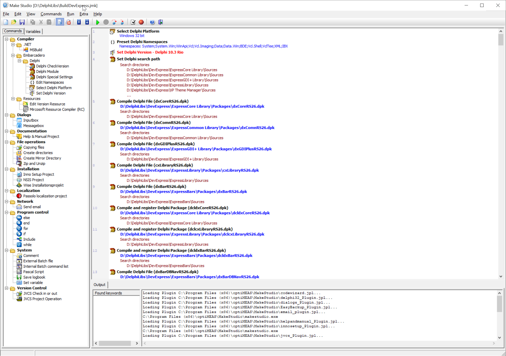
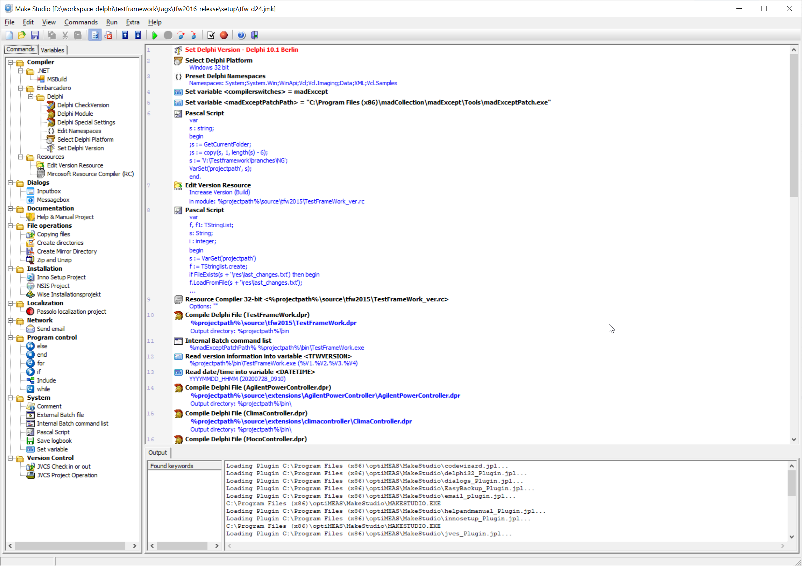
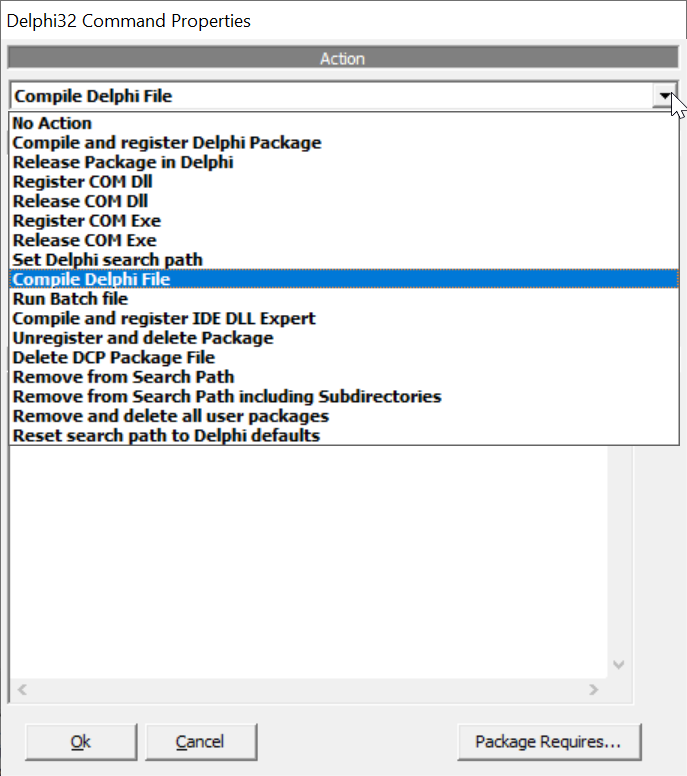
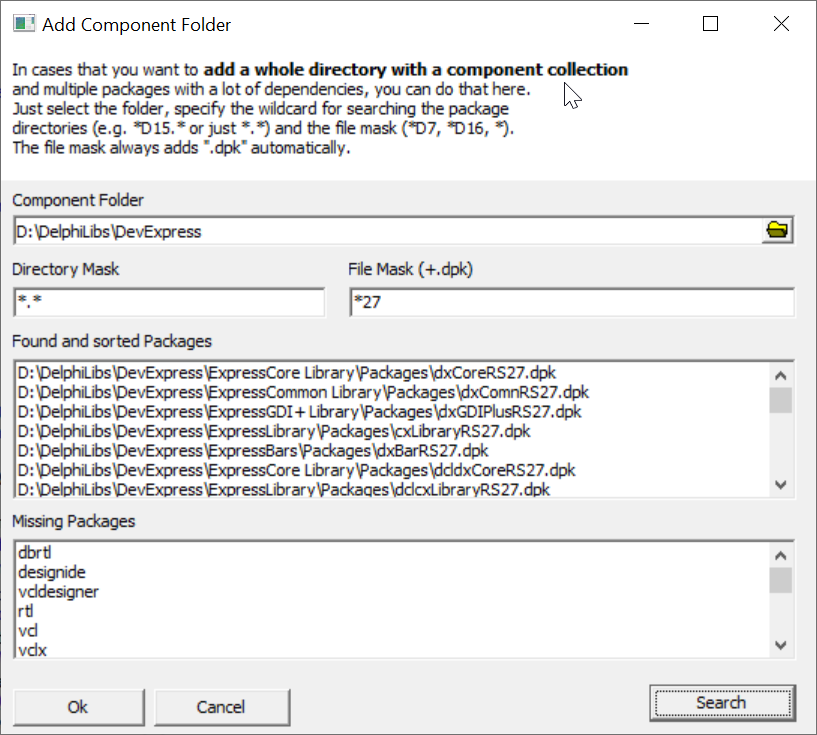

# makestudio

Setup your Delphi Environment very easily - build your projects with more comfort

## What is MakeStudio

MakeStudio is a is a tool that enables developers and build masters to create an **automated build**, **deploying software**, **compiling and installing developer components**. Its essential power is the speed of creating build processes.
All Build commands are placed in **external plugins** which could be written either in any Win32 or .NET language. The interface to **create your own plugins** is fully documented and opensource.

## What are the differences to other Build tools

The original idea for makestudio was born during multiple installations of the Delphi IDE. Many packages had to be compiled and registered which took a lot of time. The first version for **automated setup of the Delphi IDE** was created and saved a lot of work and time.
This is still the case today until Delphi version 10.3 and within 2020 10.4

In the following years makestudio developed into a comfortable **open source build tool** for Windows projects. With focus not only on Delphi.

MakeStudio is especially designed to increase the speed in creating build processes and installing whole development environments on new PC's including programming components.
You simply **drop files from the explorer** window into the MakeStudio editor and **MakeStudio selects the best action by itself**.

Another outstanding feature are the **process control structures like if, while or loop**. With these control commands it is possible to create more flexible build, compile and installation sequences.

## Current limitation

- The pascal scripting plugin will produce an exception ("could not call proc") when executing a script using variants (see <https://github.com/remobjects/pascalscript/issues/232>)

## Screenshots

### Setting up Delphi IDE

### Build and deploy project

### Script editor

### Commands tree

### Delphi module

### Add component folder dialog

